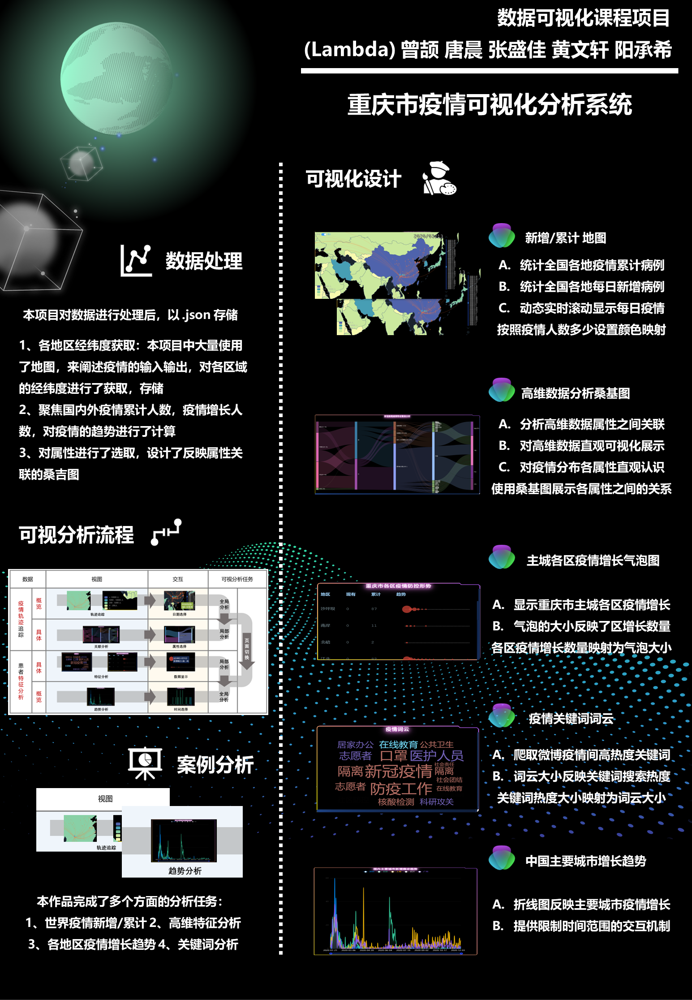

# Chongqing COVID-19 Data Visualization Project 📊

## Introduction 📝

This project is a comprehensive data visualization of the COVID-19 pandemic's impact on Chongqing, inspired by the themes and challenges presented in the ChinaVis2020 competition. Our aim is to provide insightful visual representations of the pandemic data to facilitate better understanding and analysis.

## Features 🌟

- **Interactive Dashboards**: Dynamic and interactive visualizations that allow users to explore various aspects of the COVID-19 data.
- **Time Series Analysis**: Visual representations of how the pandemic has evolved over time in Chongqing.
- **Geographical Data Mapping**: Maps showing the spread and intensity of COVID-19 across different regions in Chongqing.
- **Statistical Analysis**: Comprehensive statistical breakdowns offering detailed insights into the pandemic’s trends and patterns.

## Project Poster 🖼️

This poster provides an overview of our project's scope, design approach, and key features.

## Demos 🔗

- **Live Demo**: [🌐 Access](https://www.212.monster/)
- **Video Demo**: [▶️ Demo](https://www.bilibili.com/video/BV1Mg4y1K7wF/?spm_id_from=333.337.search-card.all.click)

Explore our live interactive application and watch our demo video for a detailed walkthrough.

## Getting Started 🚀

To explore the project locally:

1. Clone the repository.
2. Navigate to the project directory.
3. Install dependencies.
4. Run the application.

## Contributions and Feedback 🤝

We welcome contributions and feedback to improve this project. Please feel free to raise issues or submit pull requests on our GitHub repository: [🔗 Code](https://github.com/Zzz212zzZ/vis_final)

## License 📄

This project is licensed under the MIT License - see the [LICENSE](LICENSE) file for details.

---

We hope this project offers valuable insights and a unique perspective on the COVID-19 data for Chongqing. Your feedback and contributions are highly appreciated!
